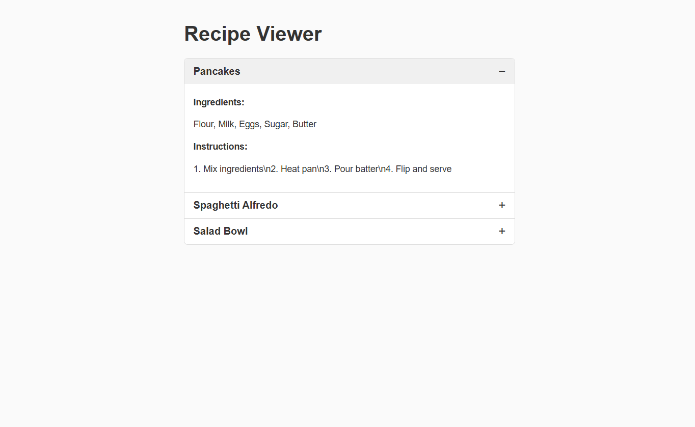

# Three-Tier Recipes System  
A simple 3-tier web application built using **Docker**, consisting of:

- **Frontend** → Nginx + HTML/JS  
- **Backend** → Python Flask API  
- **Database** → PostgreSQL  
- **Orchestration** → Docker Compose  

The app displays a list of recipes and allows the user to view each recipe’s full details.  
Data is stored in PostgreSQL, served by Flask, and rendered in the frontend UI.

---

## 📂 Project Structure
```
three_tier_recipes_system/
├── database/
│ ├── Dockerfile
│ └── init.sql
│
├── backend/
│ ├── Dockerfile
│ ├── app.py
│ └── requirements.txt
│
├── frontend/
│ ├── Dockerfile
│ ├── index.html
│ └── nginx.conf
│
└── docker-compose.yml
```
---

## 🗄️ Database (PostgreSQL)

The database is created through the `database/Dockerfile`, which loads `init.sql`  
automatically at container startup.

### **Table: recipes**

| Column        | Type      |
|---------------|-----------|
| id            | SERIAL PK |
| name          | TEXT      |
| ingredients   | TEXT      |
| instructions  | TEXT      |

### **init.sql populates 3 sample recipes**

- Pancakes  
- Spaghetti Alfredo  
- Salad Bowl  

---

## 🖥️ Backend (Flask API)

The backend connects to Postgres using psycopg2 and exposes:

### **API Endpoints**
| Method | Route             | Description                      |
|--------|------------------|----------------------------------|
| GET    | `/recipes`       | Returns list of recipe names     |
| GET    | `/recipes/<id>`  | Returns full recipe details      |
| GET    | `/health`        | Simple health check              |

Runs on **port 5000** inside the container.

Environment variables are passed through `docker-compose.yml`:
- DB_HOST  
- DB_PORT  
- DB_USER  
- DB_PASSWORD  
- DB_NAME  

---

## 🌐 Frontend (Nginx)

Frontend includes:
- `index.html` (UI)
- `nginx.conf` (reverse proxy)

### Features:
- Fetches recipe list from `/api/recipes`
- On click, loads `/api/recipes/<id>`
- Displays details dynamically

### Nginx does:
- Serve static HTML on **port 80**
- Proxy `/api/*` → backend:5000

Docker maps:
localhost:8080 → container port 80


---

## 🐳 Docker Compose

`docker-compose.yml` launches all 3 services:

- **db** → PostgreSQL  
- **backend** → Flask  
- **frontend** → Nginx  

All containers communicate over an internal Docker network.

### Run the full system:

```bash
docker compose up --build
```

Stop containers:
```bash
docker compose down
```

### 🌍 Access the Application
#### Frontend (UI):

http://localhost:8080

#### Backend API (test endpoints):

http://localhost:5000/recipes

http://localhost:5000/recipes/1

#### PostgreSQL (from outside Docker):
port: 5432

user: appuser

password: apppassword

database: recipesdb

### 🧩 Architecture Diagram

A detailed architecture diagram of the system:

User Browser --> Nginx (Frontend) --> Flask (Backend) --> PostgreSQL (Database)

### ✔ Requirements Achieved

Three-tier architecture ✔

Separate Dockerfiles for each tier ✔

Database container with initialization script ✔

Backend container connecting to DB ✔

Frontend container calling backend ✔

Docker Compose orchestration ✔

Fully functional system ✔


## 1. Start Minikube & Enable Docker Build Inside Minikube

``` powershell
minikube start
& minikube -p minikube docker-env | Invoke-Expression
```

Expected output:

    Docker environment variables set for Minikube.

## 2. Build Docker Images

### Backend:

``` powershell
docker build -t three_tier_recipes_system-backend:latest ./backend
```

### Frontend:

``` powershell
docker build -t three_tier_recipes_system-frontend:latest ./frontend
```

## 3. Apply Kubernetes Manifests

### Postgres ConfigMap

``` powershell
kubectl apply -f k8s/postgres-configmap.yaml
```

### Postgres Deployment & Service

``` powershell
kubectl apply -f k8s/postgres-deployment.yaml
kubectl apply -f k8s/postgres-service.yaml
```

## 4. Reset Database

``` powershell
kubectl delete pod -l app=recipes-db
```

## 5. Verify Postgres Initialization

``` powershell
kubectl logs -l app=recipes-db
```

Expected:

    running /docker-entrypoint-initdb.d/init.sql
    INSERT 0 3

## 6. Deploy Backend

``` powershell
kubectl apply -f k8s/backend-deployment.yaml
kubectl apply -f k8s/backend-service.yaml
kubectl delete pod -l app=recipes-backend
```

## 7. Deploy Frontend

``` powershell
kubectl apply -f k8s/frontend-deployment.yaml
kubectl apply -f k8s/frontend-service.yaml
```

## 8. Access Application

``` powershell
minikube service recipes-frontend
```

URL example:

    http://192.168.49.2:30080


## 9. Verify Frontend in Browser

Below is the frontend showing all recipes:



## 🚨 NOTE: Nginx cannot reach the backend container.
You are in Docker Compose mode, so the only correct backend hostname is:
```
recipes_backend
```

But your logs show that you are still using the Kubernetes hostname:
```
recipes-backend
```

Correct NGINX Config for Kubernetes

Kubernetes service names **must use hyphens** (DNS-compliant):

```
recipes-backend
```

### ✔ Use this version of `nginx.conf` for K8s images:

```nginx
server {
    listen 80;
    server_name localhost;

    location / {
        root /usr/share/nginx/html;
        try_files $uri /index.html;
    }

    location /recipes {
        proxy_pass http://recipes-backend:5000;
        proxy_set_header Host $host;
        proxy_set_header X-Real-IP $remote_addr;
    }
}
```